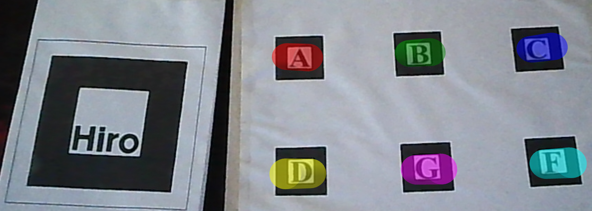
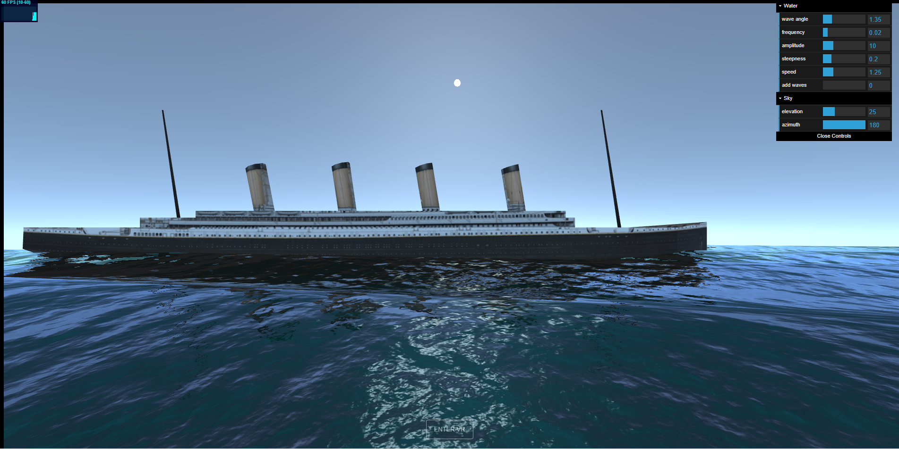

## Projects done experimenting with VR and AR
These projects were done in Visual Code with Javascript, Threejs, Aframe, Ar.js, and WebXR. I've used the live server extension of visual code to prototype and test my code modifications.

## Trabalho 1
[Ex 01](https://arthurgonze.github.io/CG/T1/t1_ex01.html).

[Ex 02](https://arthurgonze.github.io/CG/T1/t1_ex02.html).

[Ex 03](https://arthurgonze.github.io/CG/T1/t1_ex03.html).

[Ex 04](https://arthurgonze.github.io/CG/T1/t1_ex04.html).

[Ex 05](https://arthurgonze.github.io/CG/T1/t1_ex05.html).
Geometries composition and movement. - VR

[Ex 06](https://arthurgonze.github.io/CG/T1/t1_ex06.html).
Lighting testing - VR

[Ex 07](https://arthurgonze.github.io/CG/T1/t1_ex07.html).
Testing giving a geometry a texture - VR

## Trabalho 2
[Ambiente 01](https://arthurgonze.github.io/CG/T2/t2_ex01.html).

[Ambiente 02](https://arthurgonze.github.io/CG/T2/t2_ex02.html).

[Ambiente 03](https://arthurgonze.github.io/CG/T2/t2_ex03.html).
Solar system. Testing importing some texture and animations  - VR

[Ambiente 04](https://arthurgonze.github.io/CG/T2/t2_ex04.html).
Jedi Council. Testing animations and 3D models importing - VR

## Trabalho 3
[Ambiente 01](https://arthurgonze.github.io/CG/T3/t3_ex01.html).

[Ambiente 02](https://arthurgonze.github.io/CG/T3/t3_ex02.html).
This was a test in AR with markers combinations. If you put the multimarker along with Hiro multiple cylindric objects will be plotted. If you put multimarker along with kanji a black rectangular object will be plotted.

[Ambiente 03](https://arthurgonze.github.io/CG/T3/t3_ex03.html).
This was a test with animation in AR, plotting a part of the solar system. The spheres have imported textures, animation(rotation), and movement(revolution).

[Ambiente 04](https://arthurgonze.github.io/CG/T3/t3_ex04.html).
This was a test with a multimarker that you can select different objects to plot and if you hide a letter the object will be plotted on another one.

## Trabalho 4
[Ambiente 01](https://arthurgonze.github.io/CG/T4/t4_ex01.html).

[Ambiente 02](https://arthurgonze.github.io/CG/T4/t4_ex02.html).
Market items. Testing display information over interaction in VR. You'll need a VR set with an interaction button.

[Ambiente 03](https://arthurgonze.github.io/CG/T4/t4_ex03.html).
Interaction with a 3D model in VR, scaling, and rotating. You'll need a VR set with an interaction button.

[Ambiente 04](https://arthurgonze.github.io/CG/T4/t4_ex04.html).
Museum in VR. Testing some models and movement. You'll need a VR set with an interaction button.

[Ambiente 05](https://arthurgonze.github.io/CG/T4/t4_ex05.html).

## Shader Island
[Oceano](https://arthurgonze.github.io/CG/T6/water.html)
This is a project done in VR to experiment with water shader visuals. I've tried to replicate most of the ocean water characteristics without compromising too much performance in mobile systems.

[Ilha](https://karlaflorentino.github.io/RVA-2021/ProjetoIntegrado/scene.html)
This is the final project with two fellow programmers. They did the earth shader and the sky shader and I did the water shader.

